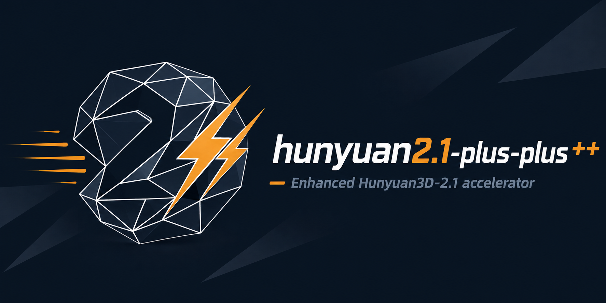

<div align="center">

<p align="center"></p>

# Hunyuan3D-2.1 + HiCache++

<p>
  <a href="https://github.com/Archerkattri/hunyuan2.1-plus-plus/releases"></a>
  <a href="https://github.com/Archerkattri/hunyuan2.1-plus-plus/releases"></a>
  <a href="LICENSE"></a>
</p>


**Tencent's Hunyuan3D-2.1 image/text-to-3D, accelerated by the HiCache++ *exponential* velocity cache on its DiT flow-matching loop.**

*HiCache++ replaces HiCache's polynomial forecast basis with a Dynamic-Mode-Decomposition (Prony) **exponential** basis — exact on the class diffusion features actually live in, so it stays lossless at larger skip intervals than the polynomial. HiCache (Hermite) is kept as the in-fork comparison baseline.*

[](https://github.com/Tencent-Hunyuan/Hunyuan3D-2.1)
&nbsp;[](https://arxiv.org/abs/2506.15442)
&nbsp;[](https://arxiv.org/abs/2508.16984)
&nbsp;[](./LICENSE)
&nbsp;-7a5cc6)

</div>

## When to use this repo

These repos are **complementary accelerators, not competing solutions** — each speeds up a *different*
base generator, and the `+` / `++` suffix is a **method choice**, not a rival product. Pick by
**(1) which base model you run**, then **(2) which forecast basis you want**:

| base generator | `+` = HiCache (Hermite) | `++` = HiCache++ (DMD) |
|---|---|---|
| Hunyuan3D-2.1 | `hunyuan2.1-plus` | `hunyuan2.1-plus-plus` |
| Hunyuan3D-2 mini | `hunyuan2-plus` | `hunyuan2-plus-plus` |
| SAM 3D Objects | `sam3d-plus` | `sam3d-plus-plus` |
| Fast-SAM3D | `fastsam3d-plus` | `fastsam3d-plus-plus` |
| TRELLIS (v1) | `faster-trellis` | `faster-trellis-plus-plus` |
| TRELLIS.2-4B (v2) | `hermit-trellis2` | `hermit-trellis2-plus-plus` |

- **`+` (HiCache / scaled-Hermite):** the *published* polynomial velocity-forecast basis — conservative, reproduces the HiCache paper. Use it to deploy the established method.
- **`++` (HiCache++ / DMD exponential):** our Dynamic-Mode-Decomposition basis — *the same near-lossless quality at wider skip intervals*, where the polynomial diverges. Use it when you push the cache interval for more speed.
- **standalone / model-agnostic:** [`hicache-plus-plus`](https://github.com/Archerkattri/hicache-plus-plus) — the forecaster itself, to add DMD caching to *your own* diffusion/flow model.
- **`fast-trellis2`** = the TaylorSeer baseline fork (the upstream "Fast" accel) — the v2 reference point, not a HiCache variant.

> **This repo:** `hunyuan2.1-plus-plus` — **Hunyuan3D-2.1 × HiCache++ (DMD)** — exponential cache; holds ≈0.86 F-score at interval-5 where Hermite drops to 0.74.

---

## What this is

[Hunyuan3D-2.1](https://github.com/Tencent-Hunyuan/Hunyuan3D-2.1) (© Tencent) generates a textured 3D asset from a single image (or text): a DiT **flow-matching** sampler denoises a latent shape, then a paint stage textures it. The shape sampler is the cost — one DiT forward per sampling step.

This fork accelerates that loop with **HiCache++**. On most sampling steps the expensive `self.model(...)` forward is skipped and the (CFG-combined) flow-matching velocity is *forecast* from cached anchors, so the DiT runs only every `interval` steps. The forecaster is a **first-class part of the pipeline** — `Hunyuan3DDiTFlowMatchingPipeline.__call__` reads it natively, with **no monkey-patching** — and is training-free and geometry-preserving. The Hermite (polynomial) HiCache forecaster ships too, as the comparison baseline.

## Method — DMD exponential forecast

Every modern feature cache skips the network and *forecasts* the velocity; they differ in the **basis** used to extrapolate, and the basis is what sets the skip ceiling. HiCache / TaylorSeer / FoCa forecast with a **polynomial** (or rational) basis. But a diffusion feature trajectory across timesteps is the solution of a near-linear feature-ODE, whose **exact** solution class is a sum of (damped / oscillatory) **exponentials** — `F_t = Σ_j a_j e^{μ_j t}`. A polynomial is only a local Taylor truncation of that, so it **diverges** under extrapolation, which is exactly why every polynomial cache caps out at a modest skip.

HiCache++ forecasts with **Dynamic Mode Decomposition** (Schmid 2010) — the SVD-regularised generalisation of **Prony's method** (1795) / **Matrix-Pencil** (Hua–Sarkar 1990). It identifies the linear propagator `A` from raw velocity snapshots (`F_{t+1} ≈ A F_t`), eigendecomposes it once, and predicts any (fractional) horizon `k` by eigenvalue powers:

```
F_{t+k} ≈ Φ (λ**k ⊙ b),     b = Φ⁺ F_t
```

Because this **is** the exact solution class — not a truncation of it — DMD is exact on exponential trajectories and holds quality at skip intervals where the Hermite/Taylor polynomial drifts. One economy SVD of a `[d, n]` snapshot matrix (`d ≫ n`) is cheap relative to a DiT forward. DMD needs a **≥4-snapshot uniform window** (a real-valued conjugate pole pair costs two real DOF, so even one oscillatory mode needs 3 snapshot-pairs); during warm-up or across the non-uniform first-enhance boundary, it falls back to the Hermite forecast, so DMD acts only where it is valid.

## How to enable it

```python
from hy3dshape.pipelines import Hunyuan3DDiTFlowMatchingPipeline

pipe = Hunyuan3DDiTFlowMatchingPipeline.from_pretrained("tencent/Hunyuan3D-2.1")

# Exponential (DMD/Prony) forecaster — the new method:
pipe.enable_dmd(
    interval=5,        # one DiT forward, then interval-1 DMD forecasts
    first_enhance=2,   # always compute the first few steps (warm-up)
    history=6,         # snapshot window the DMD fit is built from
)

# equivalently, via the unified HiCache entry point with the exponential backend:
pipe.enable_hicache(interval=5, backend="dmd", history=6)

# baseline for comparison — the Hermite polynomial forecaster (default backend):
# pipe.enable_hicache(interval=3, backend="hermite", sigma=0.5)

mesh = pipe(image="assets/demo.png")[0]   # same call as upstream — caching is transparent
pipe.disable_hicache()
```

Both `enable_dmd` and `enable_hicache(backend="dmd")` just record the schedule; the denoise loop in [`hy3dshape/hy3dshape/pipelines.py`](hy3dshape/hy3dshape/pipelines.py) dispatches skipped steps to `dmd_forecast_state` (exponential) or `hicache_forecast` (Hermite fallback) by the `backend` flag. The exponential forecaster lives in [`hy3dshape/hy3dshape/hicache_dmd.py`](hy3dshape/hy3dshape/hicache_dmd.py); the Hermite baseline in [`hy3dshape/hy3dshape/hicache.py`](hy3dshape/hy3dshape/hicache.py). Both are CPU-testable with no GPU or model: `python -m hy3dshape.hy3dshape.hicache_dmd`.

## Results

At interval-5, HiCache++ (DMD) holds **F-score ≈ 0.86** where HiCache (Hermite) drops to **≈ 0.74** (uncached baseline ≈ 0.91) — Toys4K F-score@0.05, 3-seed, excluding one Go-ICP-degenerate sphere. **DMD's lead over Hermite grows with the skip interval**: the exponential basis is what extends the lossless skip range past the point where the polynomial collapses.

For the full cross-model benchmarks (controlled forecast microbenchmark, Hunyuan3D-2.1, Hunyuan3D-2-mini, SAM3D, Fast-SAM3D) and the complete Hermite-vs-exponential tables, see the standalone library **[`hicache-plus-plus`](https://github.com/Archerkattri/hicache-plus-plus)**.


### hicache-pp 1.2.0 alignment (2026-06-10)

Two updates relative to [hicache-plus-plus 1.2.0](https://github.com/Archerkattri/hicache-plus-plus):

- **Hermite comparison arm corrected.** The vendored Hermite forecast (the HiCache baseline
  arm, also the DMD warm-up fallback) evaluated the basis at `x = -k`; corrected to `x = +k`
  (the upstream TaylorSeer distance convention; `-k` flips every odd-order term). The
  published numbers above were measured with the as-released code and remain valid
  as-measured. The DMD arm itself is unaffected by the sign convention.
- **Eigencache not yet vendored.** hicache-plus-plus 1.2.0 caches the DMD eigendecomposition
  per compute window; the DMD fit vendored here still refits on every skipped step. That is
  forecast-side latency overhead only (quality is identical); the standalone library ships
  the cached fit, and porting it here is pending.

## Attribution

- **Base model:** [Hunyuan3D-2.1](https://github.com/Tencent-Hunyuan/Hunyuan3D-2.1) © Tencent — see [`PROJECT.md`](PROJECT.md) and [`LICENSE`](LICENSE) (Tencent Hunyuan 3D 2.1 Community License Agreement; note its territorial limits, large-user threshold, and no-competing-model-training restrictions). All Hunyuan3D-2.1 code, weights, and trademarks belong to Tencent.
- **HiCache** (the polynomial baseline): *HiCache: Training-free Acceleration of Diffusion Models via Hermite Polynomial Feature Forecasting* (arXiv:[2508.16984](https://arxiv.org/abs/2508.16984)). Reimplemented here as the comparison backend.
- **HiCache++** (this work): the **DMD/Prony exponential** forecaster. DMD (Schmid 2010) / Prony (1795) / Matrix-Pencil (Hua–Sarkar 1990) are classical spectral estimation; their application to **diffusion feature caching** is, to our knowledge, new.

## Weights & data

Model weights and demo/example assets are **not** committed to this repo — only the acceleration
architecture (code + integration). Download the base-model weights from the upstream project,
[Tencent-Hunyuan/Hunyuan3D-2.1](https://github.com/Tencent-Hunyuan/Hunyuan3D-2.1), per its instructions, and point the loader at them (see the code / upstream README). This
keeps the repository lightweight and avoids redistributing third-party weights.

## Citation

If you use this repository, please cite the base model and the acceleration method(s):

```bibtex
@misc{hunyuan3d2025hunyuan3d,
    title={Hunyuan3D 2.1: From Images to High-Fidelity 3D Assets with Production-Ready PBR Material},
    author={Tencent Hunyuan3D Team},
    year={2025},
    eprint={2506.15442},
    archivePrefix={arXiv},
    primaryClass={cs.CV}
}

@misc{hunyuan3d22025tencent,
    title={Hunyuan3D 2.0: Scaling Diffusion Models for High Resolution Textured 3D Assets Generation},
    author={Tencent Hunyuan3D Team},
    year={2025},
    eprint={2501.12202},
    archivePrefix={arXiv},
    primaryClass={cs.CV}
}
```

```bibtex
@misc{hicache2025,
  title  = {HiCache: Training-free Acceleration of Diffusion Models via Hermite Polynomial Feature Forecasting},
  eprint = {2508.16984}, archivePrefix = {arXiv}, primaryClass = {cs.CV}, year = {2025}
}
```

HiCache++ builds on the classical DMD / Prony / Matrix-Pencil spectral-estimation lineage:

```bibtex
@article{schmid2010dmd,
  title={Dynamic mode decomposition of numerical and experimental data},
  author={Schmid, Peter J.}, journal={Journal of Fluid Mechanics}, volume={656}, pages={5--28}, year={2010}
}
@article{hua1990matrixpencil,
  title={Matrix pencil method for estimating parameters of exponentially damped/undamped sinusoids in noise},
  author={Hua, Yingbo and Sarkar, Tapan K.}, journal={IEEE Transactions on Acoustics, Speech, and Signal Processing},
  volume={38}, number={5}, pages={814--824}, year={1990}
}
```

---

## Family

Part of the **HiCache++ acceleration family**.

- **Family hub:** [`hicache-plus-plus`](https://github.com/Archerkattri/hicache-plus-plus) — the basis library behind this adapter.
- **Sibling:** [`hunyuan2.1-plus`](https://github.com/Archerkattri/hunyuan2.1-plus) — the same base model with the HiCache (scaled-Hermite) polynomial-forecast variant.
